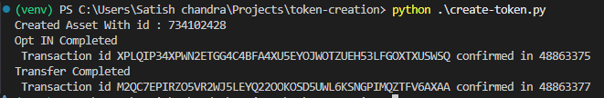

# Token Creation on Algorand Blockchain

This project demonstrates how to create, opt-in, and transfer tokens (assets) on the Algorand blockchain using Python.

## Prerequisites

- Python 3.12 or higher
- `pip` (Python package installer)

## Setup Instructions

1. **Clone the repository:**

    ```bash
    git clone https://github.com/your-username/token-creation.git
    cd token-creation
    ```

2. **Set up a virtual environment:**

    ```bash
    python -m venv venv
    venv\Scripts\activate  # On Mac use `source venv/bin/activate`
    ```

3. **Install required packages:**

    ```bash
    pip install py-algorand-sdk python-dotenv
    ```

4. **Create a `.env` file:**

    Copy the `.env.sample` file to `.env` and fill in your actual credentials.

    ```bash
    cp .env.sample .env
    ```

    Edit the `.env` file and replace the placeholder values with your actual credentials.

5. **Run the project:**

    ```bash
    python create-token.py
    ```

## Example Output

Below is an example output screen of the project:



## Project Structure

- `create-token.py`: Main script to create, opt-in, and transfer tokens.
- `.env.sample`: Sample environment variables file.
- `flow_images/output.png`: Example output image.